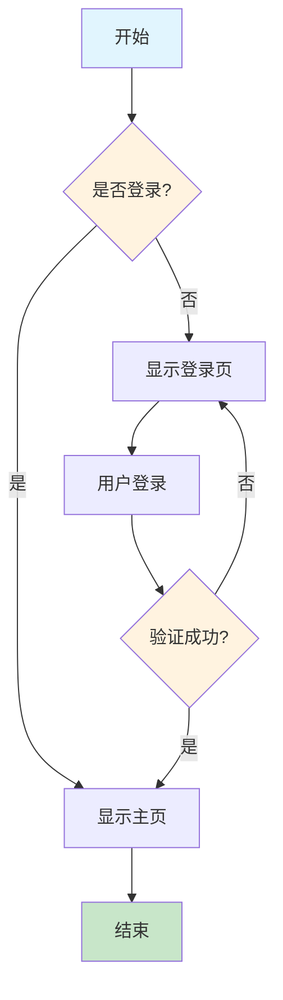
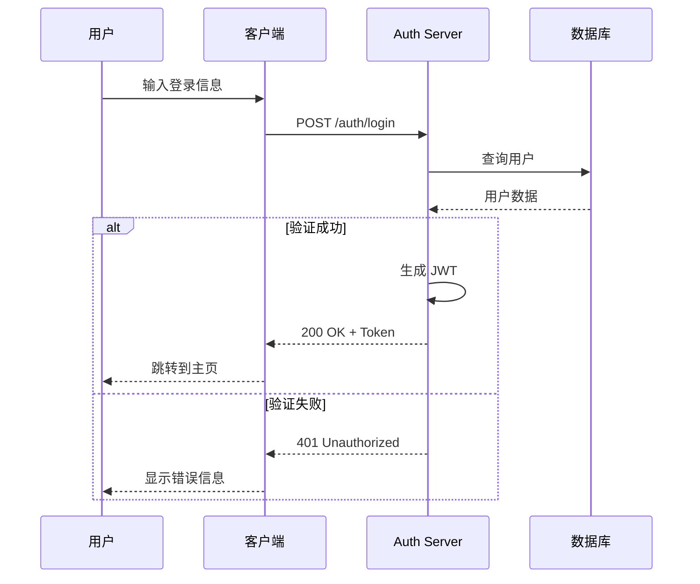
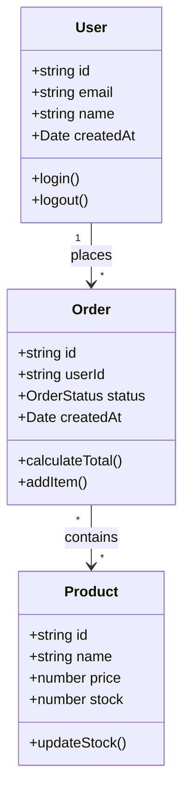
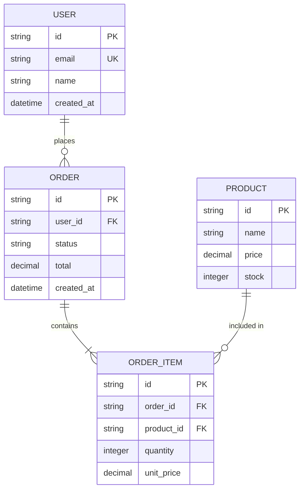
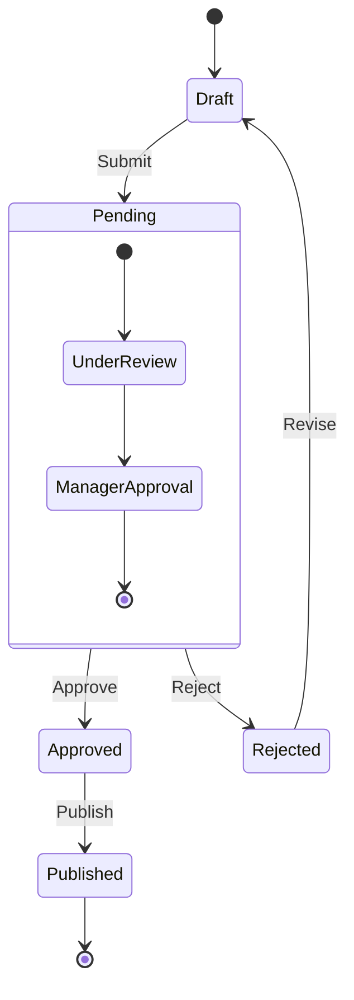
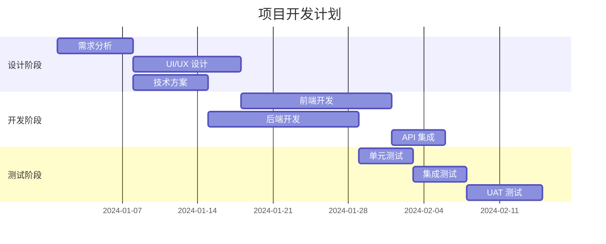
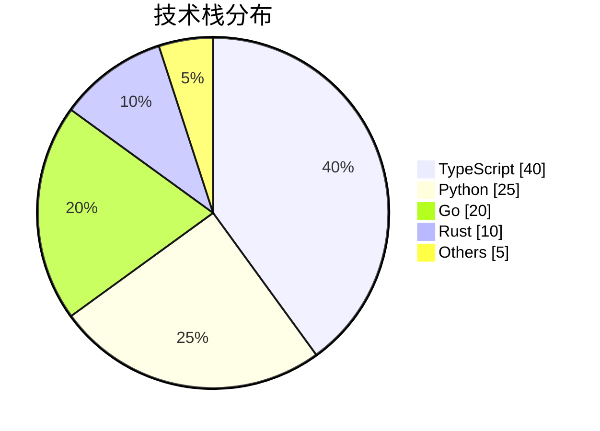
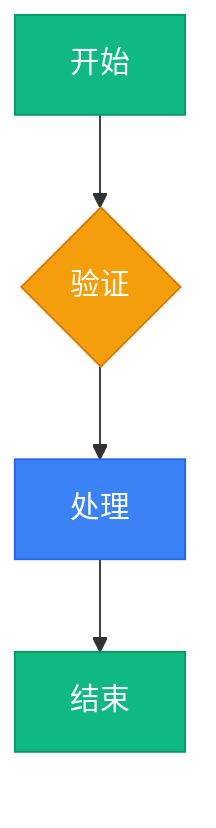

# Mermaid - 流程图与时序图

Mermaid 是一个基于 JavaScript 的图表工具，使用 Markdown 风格的文本定义来创建和动态修改图表。广泛用于技术文档、系统设计和项目规划。

## 技术栈

- **核心**: Mermaid v10+
- **渲染器**: mermaid.js, mermaid-cli
- **框架集成**: @mermaid-js/mermaid-vue, @mermaid-js/mermaid-react
- **编辑器**: VS Code Mermaid Plugin, Mermaid Live Editor
- **文档工具**: Docusaurus, VitePress, Nextra, MkDocs

## 项目结构

```
mermaid-project/
├── docs/
│   ├── architecture/         # 架构图
│   │   ├── system-overview.mmd
│   │   └── data-flow.mmd
│   ├── sequences/            # 时序图
│   │   ├── auth-flow.mmd
│   │   └── api-interaction.mmd
│   └── diagrams/
│       ├── er-diagram.mmd
│       └── class-diagram.mmd
├── src/
│   ├── components/
│   │   ├── MermaidChart.tsx  # React 组件
│   │   └── MermaidEditor.tsx # 编辑器组件
│   └── utils/
│       ├── mermaid-config.ts # 配置
│       └── diagram-validator.ts
├── scripts/
│   └── export-diagrams.ts    # 批量导出脚本
├── mermaid.config.json       # 全局配置
└── package.json
```

## 代码模式

### 基础图表类型

#### 流程图 (Flowchart)



```typescript
// 流程图配置
const flowchartCode = `
graph TB
    subgraph 前端
        A[React App] --> B[State Management]
        B --> C[API Client]
    end
    
    subgraph 后端
        D[API Gateway] --> E[Auth Service]
        D --> F[Business Logic]
        F --> G[Database]
    end
    
    C -->|HTTP/WebSocket| D
`;
```

#### 时序图 (Sequence Diagram)



```typescript
// 时序图生成器
function generateAuthSequence(options: AuthOptions): string {
  return `
sequenceDiagram
    participant Client
    participant Auth as ${options.provider}
    participant API
    participant DB
    
    Client->>Auth: Request Token
    Auth->>DB: Verify Credentials
    DB-->>Auth: User Data
    
    ${options.mfa ? 'Auth->>Client: MFA Challenge\nClient->>Auth: MFA Response\n' : ''}
    
    Auth-->>Client: Access Token
    Client->>API: API Request + Token
    API->>Auth: Validate Token
    Auth-->>API: Valid
    API-->>Client: Response
  `;
}
```

#### 类图 (Class Diagram)



#### ER 图 (Entity Relationship)



#### 状态图 (State Diagram)



#### 甘特图 (Gantt Chart)



#### 饼图 (Pie Chart)



### React 集成

```typescript
// src/components/MermaidChart.tsx
'use client';

import { useEffect, useRef, useState } from 'react';
import mermaid from 'mermaid';

interface MermaidChartProps {
  chart: string;
  config?: mermaid.Config;
  className?: string;
}

export function MermaidChart({ chart, config, className }: MermaidChartProps) {
  const containerRef = useRef<HTMLDivElement>(null);
  const [svg, setSvg] = useState<string>('');
  const [error, setError] = useState<string | null>(null);

  useEffect(() => {
    mermaid.initialize({
      startOnLoad: false,
      theme: 'default',
      securityLevel: 'loose',
      ...config,
    });
  }, [config]);

  useEffect(() => {
    const renderChart = async () => {
      try {
        setError(null);
        const id = `mermaid-${Date.now()}`;
        const { svg } = await mermaid.render(id, chart);
        setSvg(svg);
      } catch (err) {
        setError(err instanceof Error ? err.message : 'Failed to render chart');
        console.error('Mermaid render error:', err);
      }
    };

    renderChart();
  }, [chart]);

  if (error) {
    return (
      <div className="p-4 bg-red-50 border border-red-200 rounded-lg text-red-700">
        <p className="font-semibold">图表渲染错误</p>
        <pre className="text-sm mt-2 overflow-x-auto">{error}</pre>
      </div>
    );
  }

  return (
    <div
      ref={containerRef}
      className={`mermaid-container ${className || ''}`}
      dangerouslySetInnerHTML={{ __html: svg }}
    />
  );
}

// 使用示例
function App() {
  const flowchart = `
    graph LR
      A[Start] --> B{Decision}
      B -->|Yes| C[OK]
      B -->|No| D[End]
  `;

  return (
    <div className="p-8">
      <h1>系统架构</h1>
      <MermaidChart 
        chart={flowchart}
        config={{ theme: 'dark' }}
        className="my-8"
      />
    </div>
  );
}
```

### 动态图表生成

```typescript
// src/utils/diagram-generator.ts
interface TableInfo {
  name: string;
  columns: { name: string; type: string; isPK?: boolean; isFK?: boolean }[];
}

export function generateERDiagram(tables: TableInfo[]): string {
  const entities = tables
    .map(
      (table) => `
    ${table.name} {
      ${table.columns
        .map((col) => {
          let modifiers = '';
          if (col.isPK) modifiers += ' PK';
          if (col.isFK) modifiers += ' FK';
          return `${col.type} ${col.name}${modifiers}`;
        })
        .join('\n      ')}
    }
  `
    )
    .join('\n');

  return `erDiagram\n${entities}`;
}

// 从 Prisma Schema 生成
export function prismaToMermaid(schema: string): string {
  const models: TableInfo[] = [];
  const modelRegex = /model (\w+) \{([^}]+)\}/g;
  let match;

  while ((match = modelRegex.exec(schema)) !== null) {
    const [, name, fields] = match;
    const columns = fields
      .split('\n')
      .filter((line) => line.trim() && !line.includes('@'))
      .map((line) => {
        const parts = line.trim().split(/\s+/);
        return {
          name: parts[0],
          type: parts[1] || 'string',
          isPK: line.includes('@id'),
          isFK: line.includes('@relation'),
        };
      });

    models.push({ name, columns });
  }

  return generateERDiagram(models);
}
```

### 主题配置

```typescript
// src/utils/mermaid-config.ts
import type { Config } from 'mermaid';

export const lightTheme: Config = {
  theme: 'default',
  themeVariables: {
    primaryColor: '#3b82f6',
    primaryTextColor: '#1e293b',
    primaryBorderColor: '#2563eb',
    lineColor: '#64748b',
    secondaryColor: '#f1f5f9',
    tertiaryColor: '#e2e8f0',
    background: '#ffffff',
    mainBkg: '#ffffff',
    nodeBorder: '#3b82f6',
    clusterBkg: '#f8fafc',
    titleColor: '#0f172a',
    edgeLabelBackground: '#ffffff',
  },
  flowchart: {
    curve: 'basis',
    padding: 15,
    nodeSpacing: 50,
    rankSpacing: 50,
  },
  sequence: {
    actorMargin: 50,
    boxMargin: 10,
    noteMargin: 10,
    messageMargin: 35,
    mirrorActors: false,
  },
};

export const darkTheme: Config = {
  theme: 'dark',
  themeVariables: {
    primaryColor: '#3b82f6',
    primaryTextColor: '#f1f5f9',
    primaryBorderColor: '#60a5fa',
    lineColor: '#94a3b8',
    secondaryColor: '#1e293b',
    tertiaryColor: '#334155',
    background: '#0f172a',
    mainBkg: '#1e293b',
    nodeBorder: '#3b82f6',
    clusterBkg: '#1e293b',
    titleColor: '#f1f5f9',
    edgeLabelBackground: '#1e293b',
  },
};

// 自定义主题
export const customTheme: Config = {
  theme: 'base',
  themeVariables: {
    primaryColor: '#10b981',
    primaryTextColor: '#ffffff',
    primaryBorderColor: '#059669',
    lineColor: '#6b7280',
    secondaryColor: '#f3f4f6',
    tertiaryColor: '#e5e7eb',
    fontFamily: 'Inter, system-ui, sans-serif',
  },
};
```

### 编辑器组件

```typescript
// src/components/MermaidEditor.tsx
'use client';

import { useState } from 'react';
import { MermaidChart } from './MermaidChart';

const defaultCode = `graph LR
    A[开始] --> B{判断}
    B -->|是| C[执行]
    B -->|否| D[结束]
    C --> D`;

export function MermaidEditor() {
  const [code, setCode] = useState(defaultCode);
  const [copied, setCopied] = useState(false);

  const handleCopy = async () => {
    await navigator.clipboard.writeText(code);
    setCopied(true);
    setTimeout(() => setCopied(false), 2000);
  };

  const handleDownload = () => {
    const blob = new Blob([code], { type: 'text/plain' });
    const url = URL.createObjectURL(blob);
    const a = document.createElement('a');
    a.href = url;
    a.download = 'diagram.mmd';
    a.click();
    URL.revokeObjectURL(url);
  };

  return (
    <div className="grid grid-cols-2 gap-4 h-[600px]">
      <div className="flex flex-col">
        <div className="flex items-center justify-between mb-2">
          <h3 className="font-semibold">Mermaid 代码</h3>
          <div className="flex gap-2">
            <button
              onClick={handleCopy}
              className="px-3 py-1 text-sm bg-gray-100 rounded hover:bg-gray-200"
            >
              {copied ? '已复制' : '复制'}
            </button>
            <button
              onClick={handleDownload}
              className="px-3 py-1 text-sm bg-blue-500 text-white rounded hover:bg-blue-600"
            >
              下载
            </button>
          </div>
        </div>
        <textarea
          value={code}
          onChange={(e) => setCode(e.target.value)}
          className="flex-1 p-4 font-mono text-sm border rounded-lg resize-none focus:ring-2 focus:ring-blue-500"
          spellCheck={false}
        />
      </div>
      <div className="flex flex-col">
        <h3 className="font-semibold mb-2">预览</h3>
        <div className="flex-1 p-4 border rounded-lg overflow-auto bg-white">
          <MermaidChart chart={code} />
        </div>
      </div>
    </div>
  );
}
```

## 最佳实践

### 1. 图表命名和组织

```typescript
// 文件命名约定
docs/diagrams/
├── flow/
│   ├── user-auth-flow.mmd
│   ├── payment-flow.mmd
│   └── data-sync-flow.mmd
├── sequence/
│   ├── api-auth-sequence.mmd
│   └── order-sequence.mmd
└── architecture/
    ├── system-overview.mmd
    └── microservices.mmd

// 在文档中引用
// docs/api/authentication.md
\`\`\`mermaid
<<./diagrams/sequence/api-auth-sequence.mmd
\`\`\`
```

### 2. 样式一致性



### 3. 复杂图表拆分

```typescript
// 拆分大型图为子图
const mainFlow = `
graph TB
    subgraph 前端
        A[UI] --> B[状态管理]
    end
    
    subgraph 后端["后端服务"]
        C[API Gateway] --> D[Services]
    end
    
    B --> C
    
    %% 引用详细视图
    %% 详细设计见: backend-detail.mmd
`;

const backendDetail = `
graph TB
    subgraph Services
        E[Auth Service]
        F[User Service]
        G[Order Service]
    end
    
    E --> H[(Database)]
    F --> H
    G --> H
`;
```

### 4. 版本控制

```markdown
# 在 Git 中跟踪图表变更

## 图表版本历史
- 2024-01-15: 初始架构设计
- 2024-02-01: 添加微服务层
- 2024-03-10: 优化数据流

## 变更说明


### 5. 文档集成

```typescript
// Docusaurus 配置
// docusaurus.config.js
module.exports = {
  themes: ['@docusaurus/theme-mermaid'],
  markdown: {
    mermaid: true,
  },
  themeConfig: {
    mermaid: {
      theme: 'default',
      options: {
        flowchart: {
          curve: 'basis',
        },
      },
    },
  },
};

// VitePress 配置
// .vitepress/config.ts
import { withMermaid } from 'vitepress-plugin-mermaid';

export default withMermaid({
  // 配置
});
```

## 常用命令

### CLI 工具

```bash
# 安装 Mermaid CLI
npm install -g @mermaid-js/mermaid-cli

# 生成图片
mmdc -i diagram.mmd -o diagram.png

# 生成 SVG
mmdc -i diagram.mmd -o diagram.svg

# 指定主题
mmdc -i diagram.mmd -o diagram.png -t dark

# 使用配置文件
mmdc -i diagram.mmd -o diagram.png -c mermaid.config.json

# 批量转换
mmdc -i ./diagrams/ -o ./output/

# 监听文件变化
mmdc -i diagram.mmd -o diagram.png -w
```

### 开发命令

```bash
# 安装依赖
npm install mermaid

# React 集成
npm install mermaid react-mermaid2

# Vue 集成
npm install mermaid @mermaid-js/mermaid-vue

# TypeScript 类型
npm install -D @types/mermaid
```

### 验证和测试

```bash
# 验证语法
mmdc -i diagram.mmd -e json

# 输出 AST
mmdc -i diagram.mmd -o diagram.json

# 运行测试
npm test -- --grep "mermaid"
```

## 部署配置

### 批量导出脚本

```typescript
// scripts/export-diagrams.ts
import { execSync } from 'child_process';
import { glob } from 'glob';
import path from 'path';
import fs from 'fs';

const config = {
  input: 'docs/diagrams/**/*.mmd',
  output: 'public/diagrams',
  formats: ['svg', 'png'] as const,
  theme: 'default',
};

async function exportDiagrams() {
  const files = await glob(config.input);
  const outputDir = path.resolve(config.output);

  if (!fs.existsSync(outputDir)) {
    fs.mkdirSync(outputDir, { recursive: true });
  }

  for (const file of files) {
    const name = path.basename(file, '.mmd');
    const relativePath = path.dirname(file).replace('docs/diagrams', '');

    for (const format of config.formats) {
      const outputPath = path.join(
        outputDir,
        relativePath,
        `${name}.${format}`
      );

      const outputDirPath = path.dirname(outputPath);
      if (!fs.existsSync(outputDirPath)) {
        fs.mkdirSync(outputDirPath, { recursive: true });
      }

      console.log(`Converting ${file} to ${format}...`);
      execSync(
        `mmdc -i "${file}" -o "${outputPath}" -t ${config.theme}`,
        { stdio: 'inherit' }
      );
    }
  }

  console.log(`\nExported ${files.length} diagrams to ${outputDir}`);
}

exportDiagrams().catch(console.error);
```

### CI/CD 集成

```yaml
# .github/workflows/diagrams.yml
name: Export Diagrams

on:
  push:
    paths:
      - 'docs/diagrams/**/*.mmd'

jobs:
  export:
    runs-on: ubuntu-latest
    steps:
      - uses: actions/checkout@v4
      
      - name: Setup Node.js
        uses: actions/setup-node@v4
        with:
          node-version: '20'
          
      - name: Install Mermaid CLI
        run: npm install -g @mermaid-js/mermaid-cli
        
      - name: Export diagrams
        run: |
          mkdir -p public/diagrams
          find docs/diagrams -name "*.mmd" -exec sh -c '
            for file; do
              name=$(basename "$file" .mmd)
              dir=$(dirname "$file" | sed "s|docs/diagrams||")
              mkdir -p "public/diagrams$dir"
              mmdc -i "$file" -o "public/diagrams$dir/$name.svg" -t default
            done
          ' sh {} +
          
      - name: Upload artifacts
        uses: actions/upload-artifact@v4
        with:
          name: diagrams
          path: public/diagrams
```

### Docker 配置

```dockerfile
FROM node:20-alpine AS builder

# 安装 Mermaid CLI
RUN npm install -g @mermaid-js/mermaid-cli

WORKDIR /app
COPY docs/diagrams ./diagrams

# 导出图表
RUN find diagrams -name "*.mmd" -exec sh -c '
  for file; do
    name=$(basename "$file" .mmd)
    dir=$(dirname "$file")
    mmdc -i "$file" -o "$dir/$name.svg" -t default
  done
' sh {} +

FROM nginx:alpine
COPY --from=builder /app/diagrams /usr/share/nginx/html/diagrams
EXPOSE 80
```

## 相关资源

- [Mermaid 官方文档](https://mermaid.js.org/)
- [Mermaid Live Editor](https://mermaid.live/)
- [VS Code Mermaid 插件](https://marketplace.visualstudio.com/items?itemName=bierner.markdown-mermaid)
- [Mermaid CLI](https://github.com/mermaid-js/mermaid-cli)
- [主题自定义](https://mermaid.js.org/config/theming.html)
